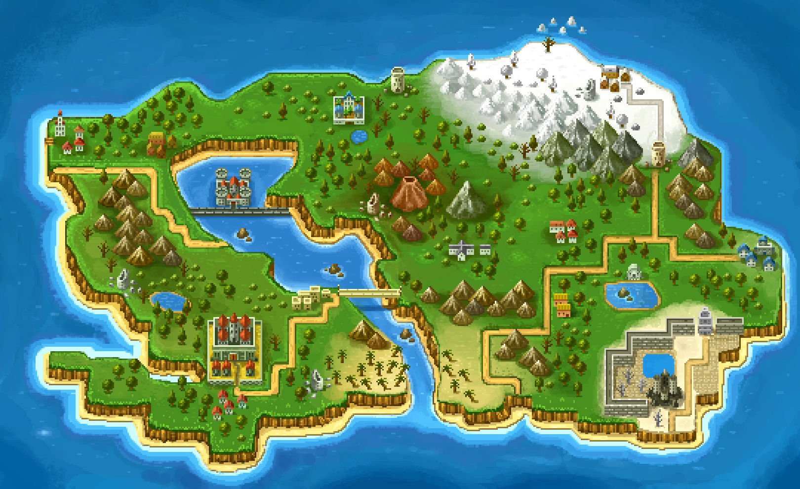

# StillPoint - Interactive Fantasy Adventure Experience



## 🌟 Overview

**StillPoint** is an immersive, interactive fantasy web experience that transports users into the mystical world of Aethel. This creative project combines storytelling, character exploration, and interactive mapping to create a unique digital adventure.

## 🎮 Features

### 📖 Interactive Storytelling
- **Digital Book Experience**: Navigate through an animated book with page-turning effects
- **Rich Narrative**: Explore the Chronicles of Eternal Conflict and the lore of Aethel
- **Character Backstories**: Discover the origins of heroes like Eryn and Lira

### 🗺️ Interactive World Map
- **Clickable Locations**: Explore 15+ interactive areas with detailed descriptions
- **Glassmorphism UI**: Beautiful modal windows with blur effects
- **Location Discovery**: Learn about castles, villages, mystical landmarks, and ancient ruins
- **Visual Indicators**: Clear pointer icons for enhanced user experience

### 👥 Character Gallery
- **3D Character Carousel**: Rotating display of game characters
- **Character Profiles**: Detailed information about each character
- **Interactive Animations**: Hover effects and smooth transitions

### 🎯 Game Elements
- **Mini-Game Integration**: Playable character with movement and animations
- **Pause Menu System**: Complete game-like controls
- **Sprite Animations**: Smooth character movements and actions

### 🎨 Visual Excellence
- **Cinematic Animations**: Text animations with Minecraft-style effects
- **Responsive Design**: Optimized for various screen sizes
- **Custom Typography**: Unique pixel-perfect fonts
- **Loading Sequences**: Engaging video introductions

## 🏗️ Technical Architecture

### Frontend Technologies
- **HTML5**: Semantic markup and structure
- **CSS3**: Advanced animations, transitions, and glassmorphism effects
- **Vanilla JavaScript**: Interactive functionality and game logic
- **Custom Fonts**: Micro font family for authentic gaming feel

### File Structure
```
stillpoint/
├── css/
│   ├── style.css      # Main stylesheet with animations
│   ├── style1.css     # Book and story page styles
│   └── style2.css     # Character page styles
├── js/
│   └── main.js        # Interactive functionality
├── img/               # Game assets and images
├── video/             # Loading screen videos
├── font/              # Custom fonts
├── index.html         # Homepage with animated text
├── story.html         # Interactive book experience
├── characters.html    # Character gallery
├── map.html           # Interactive world map
├── community.html     # Community features
└── stillpoint1.html   # Game demo
```

## 🌍 World of Aethel

### The Setting
In the fractured world of Aethel, floating islands drift through an endless sky after a great cataclysm. The **Stillpoint** represents the last anchor of the old world—a source of immense power that could reshape reality itself.

### The Three Factions
1. **The Verdant Guard** - Forest keepers seeking to heal the world through nature
2. **The Cogwork Collective** - Technological innovators building a mechanized future
3. **The Moonseer Circle** - Celestial mystics viewing the Stillpoint as a cosmic wound

### Explorable Locations
- **Central Castle** - The magnificent seat of power
- **Fire Mountain** - Active volcano with ancient forges
- **Frozen Northlands** - Harsh territories with legendary ice crystals
- **Golden Desert** - Vast dunes hiding ancient secrets
- **Academy of Mystic Arts** - Premier magical learning institution
- And many more mystical locations...

## 🚀 Getting Started

### Prerequisites
- Modern web browser (Chrome, Firefox, Safari, Edge)
- Local web server (optional, but recommended)

### Installation
1. Clone or download the repository
2. Open `index.html` in your browser, or
3. Run a local server:
   ```bash
   python -m http.server 8080
   ```
4. Navigate to `http://localhost:8080`

### Navigation
- **Home**: Animated introduction and navigation
- **Story**: Interactive book with lore and character backstories
- **Characters**: 3D carousel showcasing heroes and villains
- **Map**: Interactive world exploration
- **Community**: Social features and community content

## 🎨 Design Philosophy

### Visual Style
- **Fantasy Aesthetic**: Rich medieval and mystical themes
- **Interactive Elements**: Engaging hover effects and animations
- **Glassmorphism**: Modern UI with transparency and blur effects
- **Responsive Layout**: Seamless experience across devices

### User Experience
- **Intuitive Navigation**: Clear visual indicators and smooth transitions
- **Immersive Storytelling**: Engaging narrative presentation
- **Interactive Discovery**: Rewarding exploration mechanics
- **Performance Optimized**: Smooth animations and fast loading

## 🔧 Technical Highlights

### Advanced CSS Features
- CSS Grid and Flexbox layouts
- Custom keyframe animations
- 3D transforms and perspective
- Backdrop filters and glassmorphism
- Responsive media queries

### JavaScript Functionality
- Event-driven interactions
- Animation state management
- Dynamic content loading
- Modal window systems
- Game-like controls

## 📱 Browser Compatibility

- ✅ Chrome 88+
- ✅ Firefox 84+
- ✅ Safari 14+
- ✅ Edge 88+

## 🤝 Contributing

This is a creative project showcasing interactive web development. Feel free to explore the code and adapt it for your own fantasy projects!

## 📄 License

This project is created for educational and creative purposes.

---

**Experience the magic of Aethel. Discover your destiny at the StillPoint.** 